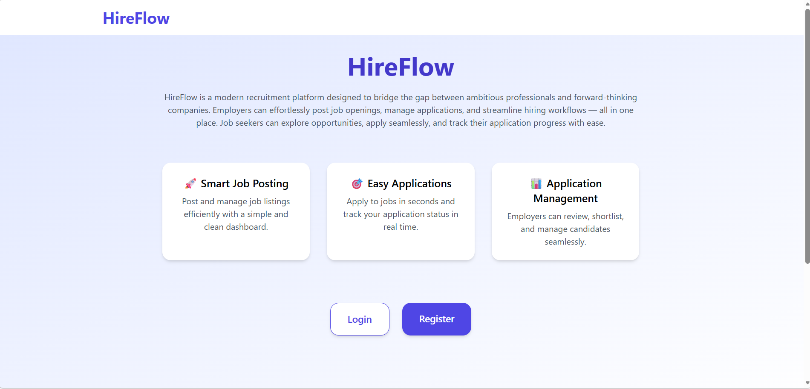
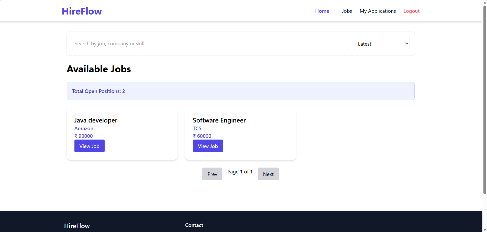
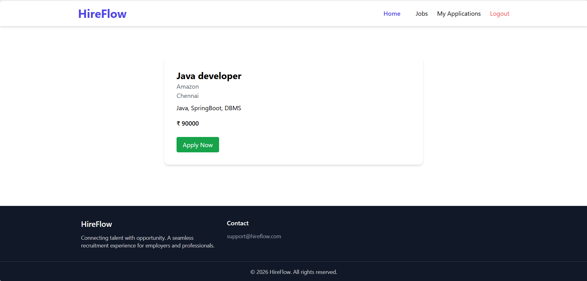
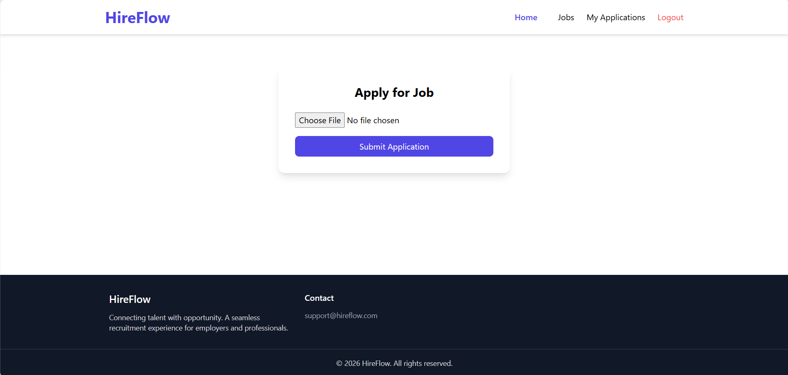
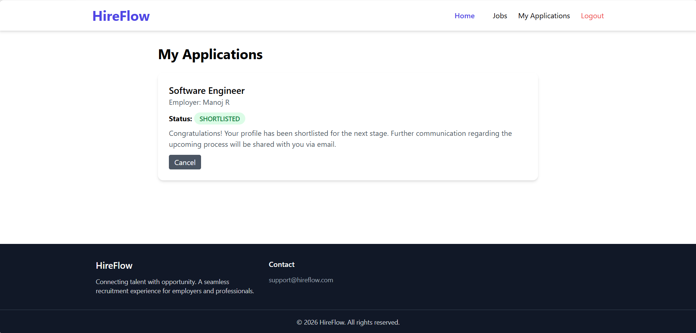
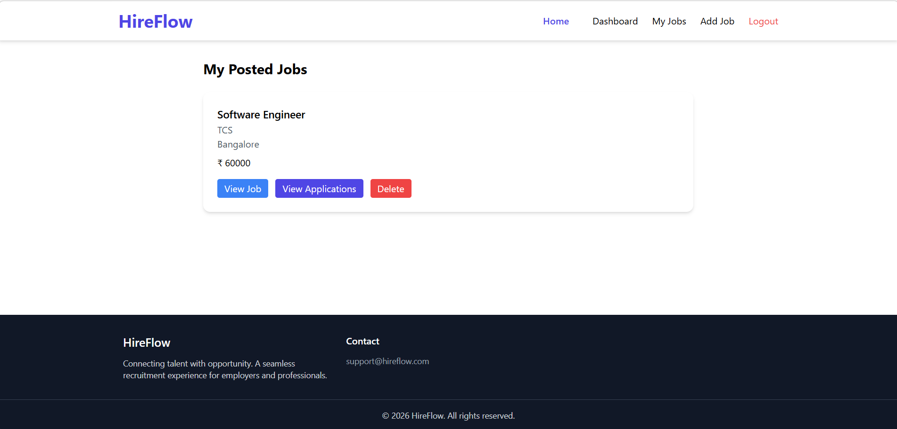
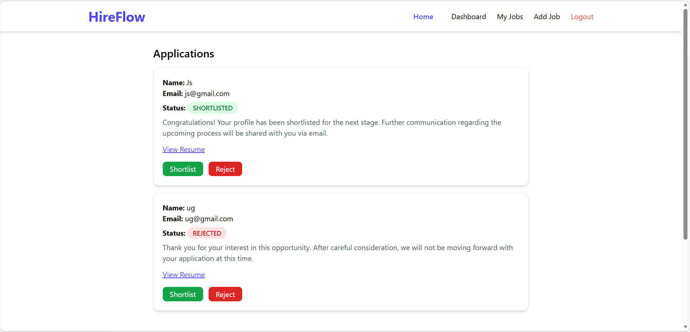

# HireFlow – Full Stack Recruitment Platform

HireFlow is a full-stack recruitment platform that connects **job seekers** with **employers**.
Employers can post jobs and manage applicants, while job seekers can explore opportunities and apply with their resumes.

The project demonstrates a modern **full-stack architecture** with secure authentication, role-based access control, resume uploads, and cloud deployment.

---

## 🚀 Live Demo

**Frontend:**
https://hireflow-1-62fu.onrender.com

**Backend API:**
https://hireflow-2sol.onrender.com

---

## 📸 Screenshots

### Home Page


### Job Seeker Interface

#### Job Listings


#### Job Details


#### Apply Job


#### Job Seeker Applications


### Employer Interface

#### Employer Posted Jobs


#### Employer Job Applications


---

## 🛠 Tech Stack

### Frontend

* React (Vite)
* Tailwind CSS
* Axios
* React Router

### Backend

* Java
* Spring Boot
* Spring Security
* JWT Authentication
* RESTful APIs

### Database

* PostgreSQL

### Deployment

* Docker
* Render (Backend & Database)
* Render (Frontend)

---

## ✨ Features

### Authentication & Authorization

* Secure user registration and login
* JWT based authentication
* Role based access (Employer / Job Seeker)

### Job Management

Employers can:

* Create job postings
* Edit or delete job listings
* View all jobs they posted

### Job Discovery

Job seekers can:

* Browse available jobs
* View detailed job information
* Search and filter jobs

### Job Applications

Job seekers can:

* Apply to jobs
* Upload resume files
* Track application status

Employers can:

* View job applicants
* Access uploaded resumes
* Shortlist or reject candidates

### File Upload

* Resume upload using `MultipartFile`
* Files served through `/uploads` endpoint

---

## 🔐 Security

* JWT based authentication
* Spring Security configuration
* Protected REST endpoints
* Role-based authorization

---

## ⚙️ Environment Variables

Example environment configuration:

### Frontend

```
VITE_API_URL=<backend-api-url>
VITE_BACKEND_URL=<backend-base-url>
```

### Backend

```
SPRING_DATASOURCE_URL=<database-url>
SPRING_DATASOURCE_USERNAME=<db-username>
SPRING_DATASOURCE_PASSWORD=<db-password>
JWT_SECRET=<jwt-secret>
PORT=<server-port>
```

---

## 🧪 Running Locally

### Backend

```
cd HireFlow-backend
./mvnw spring-boot:run
```

### Frontend

```
cd HireFlow-frontend
npm install
npm run dev
```

---

## 📌 Future Improvements

* Email notifications for application updates
* Resume parsing and skill extraction
* Job recommendation system
* Admin dashboard
* Advanced job search filters

---

## 👨‍💻 Author

**Manoj R**

GitHub:
https://github.com/ManojRTech

---

## ⭐ Support

If you found this project useful, consider giving it a star ⭐ on GitHub.
